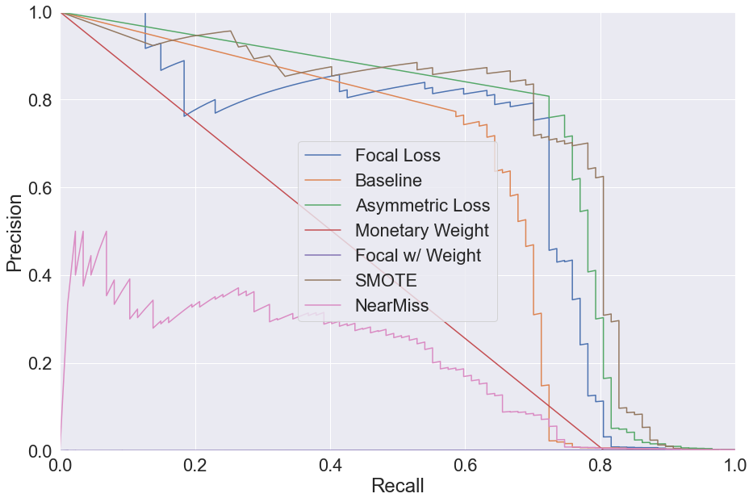
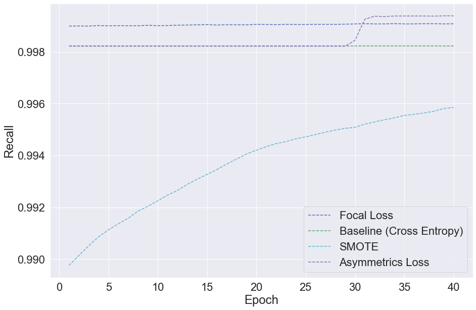
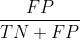

# Imbalanced Learning in Binary Classification
> by Sherman Aline & She Zhongqi

## Motivation

Imbalanced data refers to a data which has large class imbalances. This is not a problem in itself. If missclassification costs are equal across classes, and the true population is reflected in the sample population there is no problem. However if either of these does not hold, it is desirable to modify our approach.

Imbalanced Learning, then, refers to methods which try to accomodate the cases when both those requirements do not hold. In essence, these methods devise ways of modifying learning costs to better reflect the real-world costs.

Consider the case of credit card fraud. Fraud is extremely rare, but can be very costly. One fraudulent transaction can mean a loss of thousands of dollars for the company. Without imbalanced learning though, this fact is not internalized into the classification model. One missclassified transaction out of thousands is still a near-100% accuracy.

We compare several common approaches to mitigating the problems of imbalanced data, which can be categorized into two types: modification to the loss function and modification to the sample. Both these approaches, in effect aim to increase the relative weight of missclassified samples in the minority class. We also investigate an approach which is specific to our application: considering the direct monetary cost of missclassification.


 We evaluate these methods in the application to credit card fraud detection, using the dataset available at https://www.kaggle.com/mlg-ulb/creditcardfraud. We can see clearly that our dataset is extremely imbalanced. 
 
 `df['isFraud'].value_counts()`
 0   | 284315
 :-: | :-:
 1   | 492


## Model

We use the following CNN model

```
mod_focal.add(Dense(10, input_dim=input_dim, activation='relu', name='input'))
mod_focal.add(Dense(25, activation='relu', name='fc1'))
mod_focal.add(Dense(8, activation='relu', name='fc2'))
mod_focal.add(Dense(nb_classes, activation='softmax', name='output'))
```


We evaluate the following methods on a convultion neural network model. The CNN model was chosen for evaluation, primarily because Focal Loss is designed for this model. 

##### Loss-Based Methods
* Focal Loss (#focal-loss)
* Cross Entropy loss (baseline)
* Cross Entropy with Monetary Weights
* Focal Loss with Monetary Weights
* Asymmetric Loss for Cross Entropy

##### Sampling-Based Methods
* SMOTE (oversampling)
* NearMiss (undersampling)

First, we provide an overview of each method and why it is useful for imbalanced data. Second, we explain which metrics we used to compare the methods. Finally, we give a recommendation.


### Focal Loss
 Focal Loss, recently designed by Facebook Research, is an extension of Cross Entrop Loss for Convolution Neural Networks. Focal Loss updates sample weights at the end of each epoch, lowering weight on samples which were classified successfully and increasing weight on those which were missclassified. 
 This loss approach was designed for use in Object Detection for Computer Vision.
 Another benefit of this model is that it can effectively train faster by skipping overrepresented data.
### Cross Entropy loss (baseline)

Cross Entropy is a common loss measure for classification in the case of rare events.  It is calculated by generating two distributions: one from the true labels and one from the predicted labels. Kullback-Leibler divergence is used to measure the difference between the two distributions.

Theoretically, Cross Entropy loss should converge faster than MSE in gradient descent.

### Asymmetric Loss

Asymmetric Loss refers to a class of loss functions where loss is calculated differently based on both the class as well as the correct vs incorrect classification. In cases where costs are unique, this can be easily reflected in the loss function. In our case, since costs are associated more with missclassification of fraud as real, this has higher weight than the others.

In some applications costs of misclassification may differ. In our case of email fraud this is readily apparent: misclassifying a transation as fraud causes some transactional costs and inconvenience to the consumer, but misclassifying a fraudulent transaction as real can cost the credit card company thousands of dollars. We use an asymmetric loss function where false negatives are weighted more than false positives to reflect this real world cost.
 
E[classify as fraud | not fraud ] <  E[classify as real | fraud]

We assign loss for false negatives to be 4 times higher than the other classifications.

### Cross Entropy with Monetary Weights

This loss function focuses on the specific application to fraud detection. Because costs of Type II error (false negative) are directly related to the size of the transaction, we use relative cost as a weight on each observation. The variable 'Amount' is standardized such that all values are between 0 and 1.

### Focal Loss with Monetary Weights

We repeat the same weighting scheme as was applied for cross entrop, with the focal loss function.


### SMOTE
SMOTE or Synthetic Minority Over-Sampling Technique, is an extension to oversampling. Where oversampling imputes repeats of existing observations, SMOTE generates new observations. These observations are generated using K-nearest neighbors. First, a K-mean is generated from some n observations from the minority class. Second, the closest point to the mean is calculated, and a new observation is randomly imputed somewhere on the line between the mean and the true observation.

This technique is repeated so "synthesize" the desired number of minority-class samples, so that the data is more balanced.

Because this method increases the total size of the training set, it is slower.
 
### Near Miss

The NearMiss is an under-sampling technique which uses distance to eliminate majority class  samples.

The NearMiss method corresponds to the NearMiss function in the Python library, and here are several versions of applying NearMiss Algorithm:

NearMiss-1: Select samples of the majority class for which average distances to the k closest instances of the minority class is smallest

NearMiss-2: Select samples of the majority class for which average distances to the k farthest instances of the minority class is smallest.

NearMiss-3: This is a two-stage algorithm. First, for each minority sample, retain their M nearest-neighbors samples; then, those majority samples with the largest average distance to N nearest-neighbors samples will be selected.

This method increases the speed of training, since the training set is made smaller.

## Evaluation

Here are the final results of our models on the test set:


 We consider two different approaches in evaluating our models.
 * model based
 * application based 

In the model based evaluation, we focus on speed, convergence of the algorithms, and classification effectiveness for the minority class. In the applied evaluation, we consider the total monetar losses due to false negatives, and overall performance.


### Model Based Evaluation
#### Metrics
* Precision & Recall
* Speed & Convergence Rate

Since we have an extremely imbalanced data, accuracy is no longer a helpful metric for evaluating the model (it might get a high accuracy by predicting Negative all the time). Here, we use Precision-Recall (model case) and AUC (applied case) as the evaluation metrics, which are not sensitive to imbalanced data.

##### Precision & Recall

In Precision-Recall curve, the precision (y-axis) is plotted against the recall (x-axis). These quantities are defined as follows

Precision=  is the proportion of positives which were correct, out of all values predicted as positive. Precision is an important metric in the context of fraud detection because low precision will increase 

Recall=TPR= 

In general, the reliability of a classification. This plot emphasizes the trade-off between trustowrthiness of positive classification (Precision) and the amount of true positives which were correctly identified.

As an example to illustrate how this can be important, consider e-mail spam: there is a trade off between precision and TPR. WIth a high TPR, all spam is correctly identified, but if the precision is low then the user will often be retrieving emails from the spam folder. This defeats the purpose of the classifier, since the user has to manually decide anyways.



We observe that Focal Loss, Asymmetric Loss and SMOTE all perform best, becayse they have the smallest tradeoff between precision and recall, maintaining high precision until around 0.8 recall. Near Miss and monetary weights performs the worst in precision. 

##### Speed

When choosing a model, the speed of the algorithm is important for real applications. Convergence of the algorithm is also important for trustworthy results.


We observe that SMOTE performs the worst and Near Miss performs the best in terms of speed. This is intuitive, as SMOTE enlarges the train set and Near Miss shrinks the train set. The other methods perform similiarly, and none of the methods seem to get faster or slower over more epoch. In our application of focal loss, we do not observe an increased speed over time for the method, however this may be due to insufficient epochs being run for the algorithm to converge.

##### Convergence


It takes many epochs, but eventually the converges to a very high recall rate when using asymmetric loss.


Focal with monetary weights converges faster and has higher recall on the train set than without.

When comparing the rates, we put loss functions that use monetary weights on a separate graph. This is because their losses are calculated using their weights, which make their size quite different. 





#### Recommendations

Overall, we recommend Asymmetric Loss. However, by observing the epoch plot, we can see that this loss does not converge reliably in recall. So for small epochs it may be unreliable as there is no constant rate of convergence. 

Focal loss did not perform as well as expected. This is likely because our application is not as sophisticated as dense object detection, where focal loss may be relatively better than other methods. Focal loss converges slowly, but if we ran over more epoch it is possible we would get better performance as it was continuously imporving over each epoch. 

### Application Based Evaluation
#### Metrics
* AUC
* monetary losses


##### AUC (Aread Under Curve)

We use the area under curve to examine the performance of our models in the general case. The AUC plots the True Positive Rate and False Positive Rate, determining their relationship. The ideal model will be a constant of TPR = 1, for all FPR.

TPR = Recall =  is the proportion of positives which were correctly classified.

FPR =  is the proportion of negatives which were incorrectly classified as positive.

In the specific case of detecting fraudulent transactions, teh false positive rate is more interesting than the precision because false positives will require customer intervention with a phone call to reconcile. This means there will be higher labor costs to the company and possibly lower customer satisfaction.


* Focal Loss      : 0.9027227485158519
* Baseline (CE)   : 0.8925670834912214
* Asymmetric Loss : 0.9560992295061261
* Monetary Weights: 0.5278074017936087
* Focal w/ Weight : 0.13339416445623342
* SMOTE           : 0.9382737905772388
* NearMiss        : 0.8977279272451686

Focal Loss with Monetary Weights performs very poorly, worse than random binary classification would (see white dotted line). Monetary weights also performs very poorly. This shows how our AUC model does not take into account the cost of different transactions. In terms of monetary loss, we will show later that these two methods perform slightly better than their unweighted counterparts!

Asymmetric Loss and SMOTE perform the best, especially for very low false positive rates. At an FPR above 0.6, NearMiss performs slightly better than SMOTE, since it has a higher TPR for FPR > 0.6. Overall, Asymmetric Loss performs the best at maximizing AUC.

##### Monetary Loss
* Focal Loss: 8481.850000000002
* Cross Entropy (baseline): 13725.74000000000
* Near Miss: 1757.8400000000001
* SMOTE: 5136.16
* Asymmetric Loss:  5148.31
* Monetary Weights: 7634.910000000001
* Focal with Weights: 13725.740000000005

Based solely on monetary loss, Near Miss performs the best.

#### Recommendations

Overall, Asymmetric Loss is recommended due to its relatively good performance monetarily, while also performing well in TPR and FPR. Near Miss would also be useful, as it is very fast and so will perform well at scale, but the false positive rate is not ideal, which we can see from the AUC graph as well as the convolution matrix, where there are more false positives than true negatives. To categorize so many transactions as fraud will inconvenience consumers severely, resulting in a loss in business.